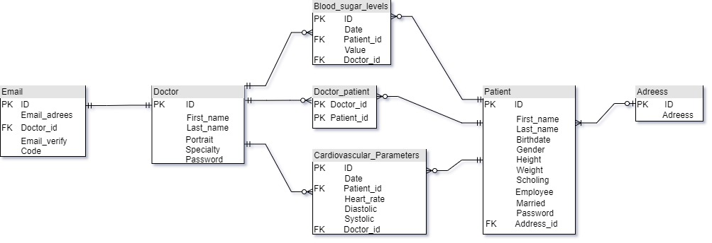

# **BioDash**

This rest API has the objective of allowing the recording and monitoring of the main cardiovascular parameters and blood glucose of patients. It is intended to be used by a health professional, but anyone who needs to keep track of their vital parameters could find it useful.

Since the operation of an API is something that normally only developers understand, I will talk to you about the main characteristics from a developer's point of view, as well as the improvement points that I will be working on and in which I would appreciate any collaboration.

## Main features
1. Built with Fastapi and Sqlalchemy.
2. Security system using OAuth2 and JWT.
3. Email verification using verification code.
4. Complex database queries.
5. Handling static files.

## Database entity relationship model
